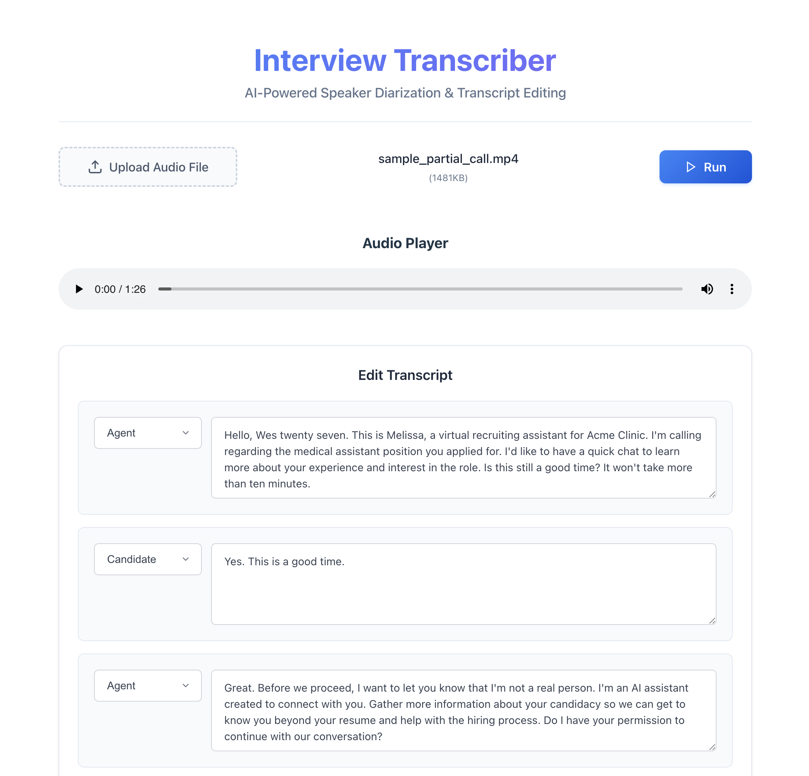
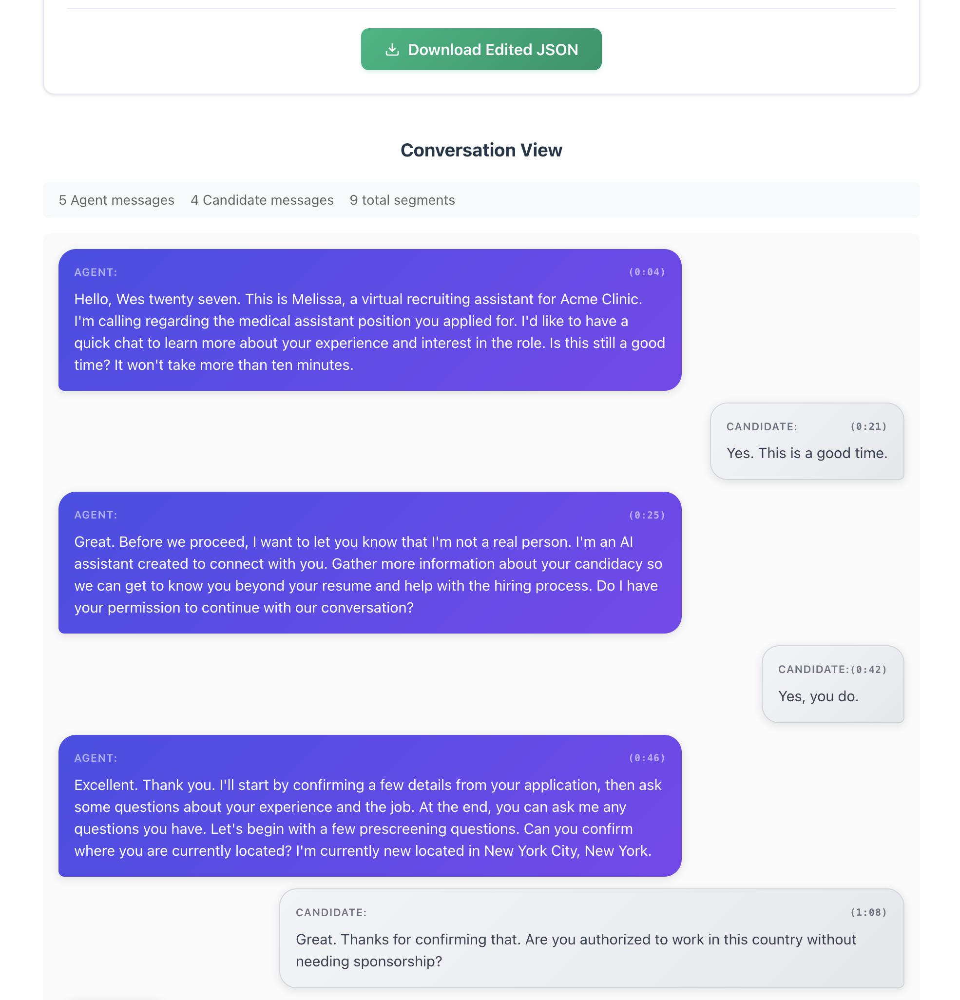

# Interview Transcriber

A modern React web application that provides AI-powered interview transcription with automatic speaker diarization using Deepgram's speech-to-text API.

## 🚀 Live Demo

**Frontend**: https://interview-transcriber-flame.vercel.app  
**Backend API**: https://interview-transcriber-server-production.up.railway.app



## ✨ Features

- 🎵 **Audio File Upload** - Support for MP4, MP3, WAV, and WebM files (max 10MB)
- 🤖 **AI Transcription** - Powered by Deepgram's advanced speech-to-text engine
- 👥 **Speaker Diarization** - Automatically separates Agent and Candidate voices
- ✏️ **Interactive Editor** - Edit speaker labels and transcript text in real-time
- 💬 **Conversation View** - Modern chat bubble visualization
- 📄 **JSON Export** - Download edited transcripts
- 📱 **Responsive Design** - Works on desktop and mobile

## 🛠 Tech Stack

- **Frontend**: React 19 + TypeScript, Vite, Vercel hosting
- **Backend**: Node.js + Express, Deepgram SDK, Railway hosting
- **AI**: Deepgram nova-2 model with speaker diarization
- **Styling**: Modern CSS with gradients and animations

## 🚀 Quick Start

### Prerequisites

- Node.js 18+
- [Deepgram API key](https://deepgram.com) (free tier available)

### Installation

```bash
# Clone and install
git clone https://github.com/kyeongan/interview-transcriber.git
cd interview-transcriber

# Backend setup
cd server
npm install
cp .env.example .env  # Add your DEEPGRAM_API_KEY

# Frontend setup
cd ../frontend
npm install
```

### Run the Application

```bash
# Terminal 1 - Start backend (port 4000)
cd server && npm start

# Terminal 2 - Start frontend (port 5173)
cd frontend && npm run dev
```

Open [http://localhost:5173](http://localhost:5173) in your browser.

## 📋 How to Use

1. Upload an audio file (MP4, MP3, WAV, WebM - max 10MB)
2. Click "Run" to transcribe with AI speaker separation
3. Edit speaker labels and text in the transcript editor
4. View the conversation in chat bubble format
5. Export as JSON when finished

## 🏗 Project Structure

```
frontend/src/
├── components/
│   ├── Header.tsx              # App branding
│   ├── FileUploader.tsx        # File upload interface
│   ├── AudioPlayer.tsx         # Audio playback
│   ├── TranscriptEditor.tsx    # Edit interface
│   ├── ConversationView.tsx    # Chat visualization
│   ├── SpeakerBubble.tsx       # Individual chat bubble
│   ├── EmptyState.tsx          # Error states
│   └── Footer.tsx              # Footer with GitHub link
├── types/index.ts              # TypeScript interfaces
├── utils/index.ts              # Utility functions
├── App.tsx                     # Main application logic
└── App.css                     # Styling

server/
├── index.js                    # Express API with Deepgram
├── uploads/                    # Audio file storage
└── package.json
```

## 🔧 Key Features

- **Modular Components**: Clean separation of concerns
- **TypeScript**: Full type safety throughout
- **Error Handling**: Comprehensive error states and user feedback
- **Responsive Design**: Mobile-first CSS with modern styling
- **Speaker Detection**: Smart fallback when AI diarization fails

## 🤝 Contributing

1. Fork the repository
2. Create a feature branch (`git checkout -b feature/amazing-feature`)
3. Commit changes (`git commit -m 'Add amazing feature'`)
4. Push to branch (`git push origin feature/amazing-feature`)
5. Open a Pull Request

## � Documentation

- **[Deployment Summary](./DEPLOYMENT_SUMMARY.md)** - Production setup and architecture decisions
- **[Frontend README](./frontend/README.md)** - React application details
- **[Backend README](./server/README.md)** - API server documentation

## �📄 License

MIT © [Karl Kwon](https://github.com/kyeongan)
